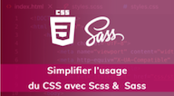

# Simplifier le CSS avec Scss, Sass & Less

*Apprendre à écrire du meilleur CSS sur **Alphorm** avec les langages préprocesseurs: des extensions du langage CSS de qualité professionnelle pour écrire du CSS robuste, stable et maintenable :* 

See [example](https://less-lib.web.app/)  
[télécharger le paquet npm](https://www.npmjs.com/package/@sandyl.tech/sassy-buttons)

## Ce que nous allons apprendre :
- Les fonctions étendues : variables, la syntaxe imbriquée, les fonctions, les mixins
- les modules intégrés : sass-map, sass-color
- architecture CSS modulaire : l'héritage, les directives, ordonner une base de code ordonnée, flexible et évolutive
